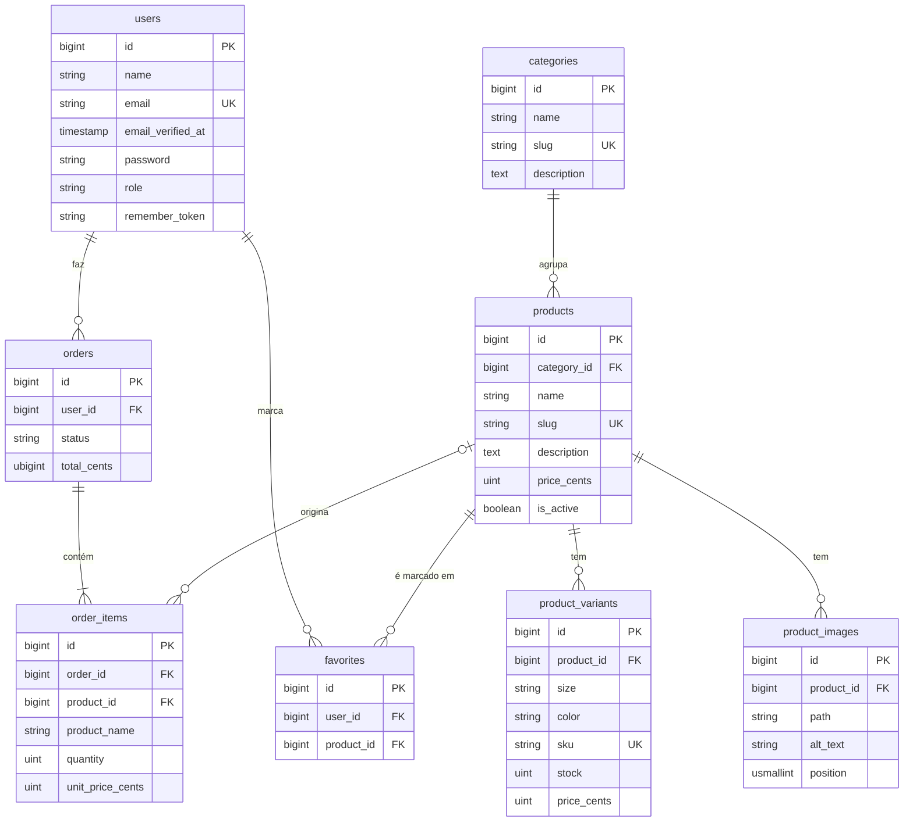

# Plataforma de E-commerce

Loja online de venda de roupa, desenvolvida em **Laravel 13** no âmbito da unidade curricular de **Programação Web do lado do Servidor** (2026/2027), Licenciatura em Engenharia Informática, Universidade Fernando Pessoa.

## Autores

| Nome | GitHub |
|---|---|
| Diogo Vicente | [@DiogoVicente8](https://github.com/DiogoVicente8) |
| João Reis | [@joaoreis2121](https://github.com/joaoreis2121) |

## Descrição

Aplicação web do lado do servidor para uma loja de roupa, com dois perfis de utilizador:

- **Cliente**: consulta o catálogo, guarda favoritos, usa o carrinho, gere moradas e métodos de pagamento e acompanha as suas encomendas.
- **Administrador**: gere o catálogo (produtos, categorias, variantes, stock e imagens) e as encomendas.

## Estado atual

| Funcionalidade | Estado |
|---|---|
| Registo, login, recuperação de password e perfil (Laravel Breeze) | Feito |
| Perfis `admin` e `customer` com acessos diferenciados (middleware `admin`) | Feito |
| Painel de administração (base) | Feito |
| Modelo de dados: catálogo, encomendas e favoritos (migrações, models e seeders) | Feito |
| Gestão de encomendas no admin (listar, ver, alterar estado e eliminar) | Feito |
| CRUD de categorias no admin | Feito |
| CRUD de produtos no admin | Em desenvolvimento |
| Catálogo público, favoritos, carrinho e checkout | Planeado |
| API REST e consumo de serviço externo | Planeado |
| Testes automatizados e publicação | Planeado |

## Tecnologias

- PHP 8.3 ou superior e Laravel 13
- Laravel Breeze (Blade) para autenticação
- Tailwind CSS, Alpine.js e Vite
- SQLite (em desenvolvimento)
- Pest para testes

## Requisitos

- PHP 8.3+ com as extensões habituais do Laravel (`mbstring`, `xml`, `curl`, `sqlite3`, `pdo_sqlite`)
- [Composer](https://getcomposer.org/)
- Node.js e npm
- Git


## Credenciais de demonstração

Criadas pelo `DatabaseSeeder`. A password de ambas é `password`.

| Perfil | Email | Acesso |
|---|---|---|
| Administrador | `admin@loja.test` | Painel em `/admin` |
| Cliente | `cliente@loja.test` | Área de cliente; 
## Testes

```bash
php artisan test
```

## Estrutura do projeto

```
app/
  Enums/                 Enums (UserRole, OrderStatus)
  Http/
    Controllers/         Controladores (Admin/ para o painel de administração)
    Middleware/          Middleware (ex.: EnsureUserIsAdmin)
    Requests/            Validação (Form Requests)
  Models/                Modelos Eloquent
  Support/               Utilitários (ex.: Money, formatação de euros)
database/
  migrations/            Migrações
  factories/             Factories
  seeders/               Dados de teste
resources/views/         Vistas Blade
routes/                  Rotas (web.php, auth.php)
tests/                   Testes Pest
```

## Modelo de dados

Os preços são guardados em cêntimos (inteiros). Os artigos de uma encomenda guardam o nome e o preço do produto no momento da compra, para o histórico não mudar se o produto for alterado ou apagado. Os favoritos são a relação de muitos-para-muitos entre utilizadores e produtos.



## Licença

Projeto académico, desenvolvido para fins de avaliação.